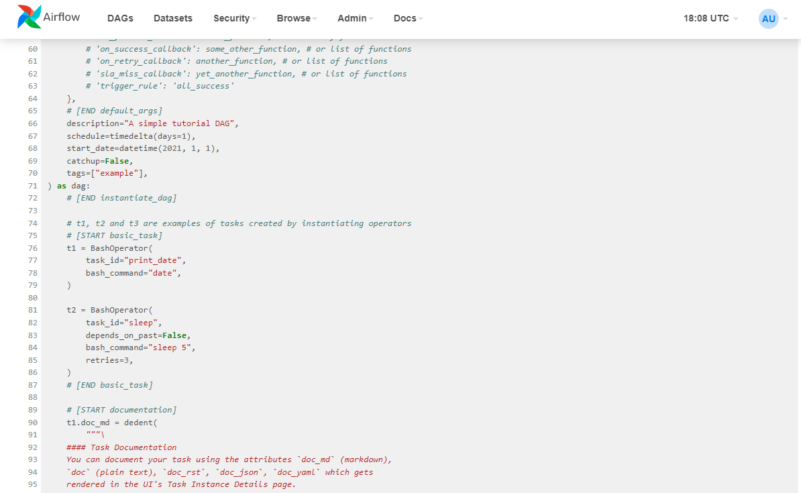

# airflow-tutorials

## 概要

Airflowの実行環境を構築して、Tutorialsを試してみる。

Tutorials:  
https://airflow.apache.org/docs/apache-airflow/stable/tutorial/index.html

実行環境は、簡単にできるようGCPのCloud Shell上にpipを用いて構築する。  
構築手順は以下のQuick Startの手順を参照。

Quick Start:  
https://airflow.apache.org/docs/apache-airflow/stable/start.html

## 実行環境の構築

Google Cloudコンソールを開き、"Cloud Shellをアクティブにする"アイコンをクリック。

Cloud Shellで以降のコマンドを実行してAirflowをインストール。

venvで作成した仮想環境にインストールする。

```
$ python -m venv airflow-env
$ source  airflow-env/bin/activate
```

Airflowのインストール。

```
$ mkdir -p airflow (ホームディレクトリ、適宜変更)
$ export AIRFLOW_HOME=~/airflow
$ AIRFLOW_VERSION=2.6.0
$ PYTHON_VERSION="$(python --version | cut -d " " -f 2 | cut -d "." -f 1-2)"
$ CONSTRAINT_URL=https://raw.githubusercontent.com/apache/airflow/constraints-${AIRFLOW_VERSION}/constraints-${PYTHON_VERSION}.txt
$ pip install "apache-airflow==${AIRFLOW_VERSION}" --constraint "${CONSTRAINT_URL}"
```

Airflowを起動。

```
$ airflow standalone
```

Cloudコンソールの"ウエブでプレビュー"アイコンをクリックして、
ブラウザからAirflowのUI画面にアクセス。  


Usernameは`admin`、Passwordは起動時のログ中に表示されていたものを入力。

```
standalone | 
standalone | Airflow is ready
standalone | Login with username: admin  password: *********
standalone | Airflow Standalone is for development purposes only. Do not use this in production!
standalone |
```
このパスワードは、`$AIRFLOW_HOME/standalone_admin_password.txt`
にも記載されている。

ログインすると登録されているDAGの一覧が表示される。


## Tutorialsを実行してみる

Tutorialsのcore conceptを実行してみる

DAGの一覧画面(DAGs)でtutorialのDAGを選択。


- Graph
  

- Code
  


## Tutorialsを改造してみる

Tutorialsのコードtutorial.pyをベースにtutorial-2.pyを作成。

ホームにdagsディレクトリを作成してutorial-2.pyを配置。

```
$ mkdir -p ~/airflow/dags/
```
airflowを再起動。

DAGの一覧画面にtutorial-2が存在している。

DAGを実行すると追加したタスクが実行されている。

「実行ログ画面」